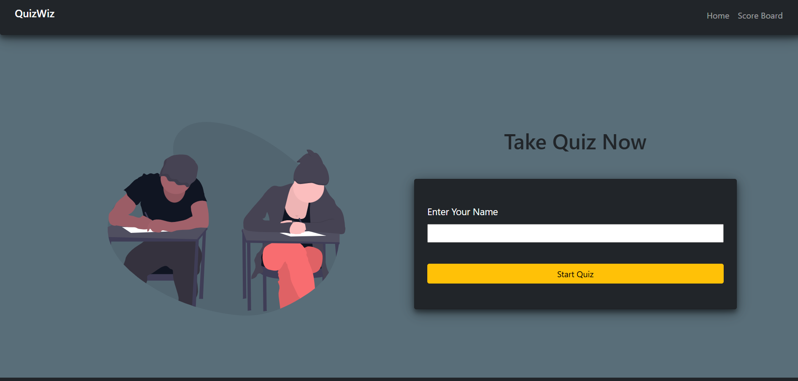
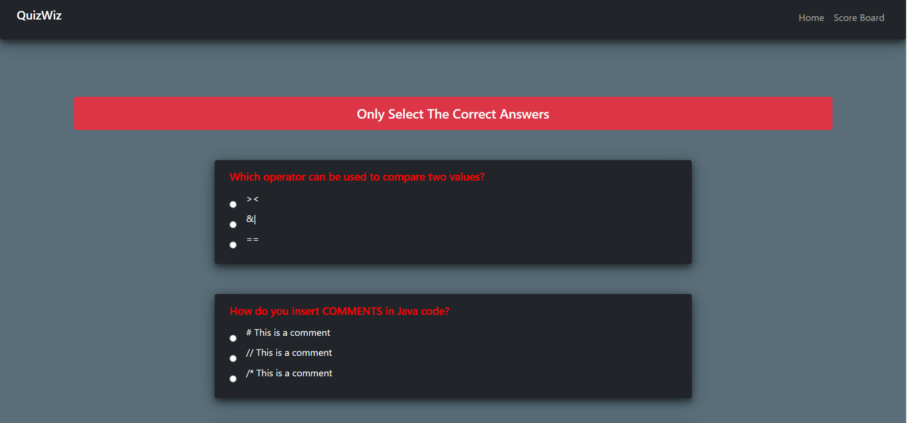
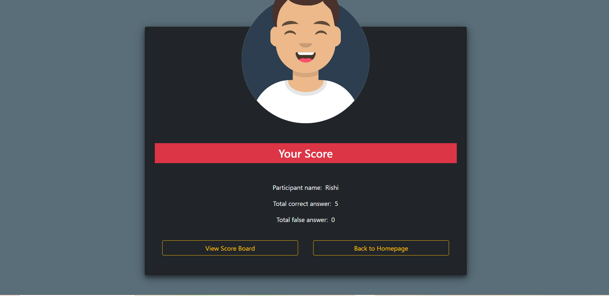
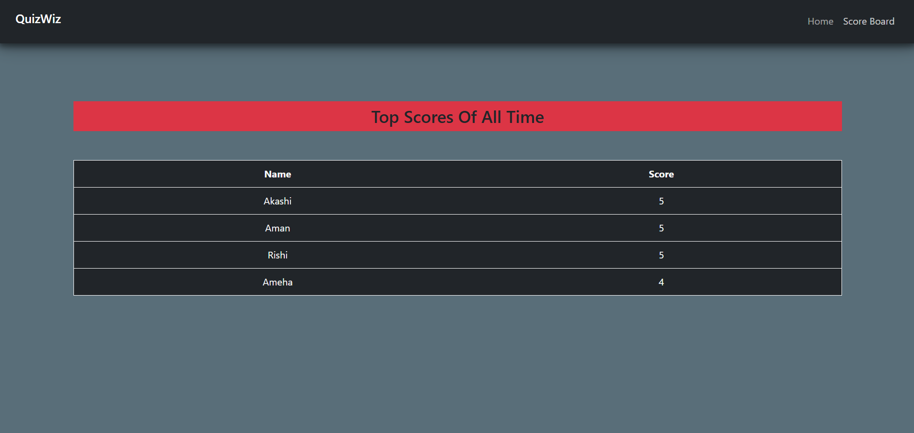

# QuizWiz





The **QuizWiz** is a simple and interactive platform that allows users to take quizzes on various topics. The app is built using **Spring Boot** for backend development, providing RESTful API services for managing quizzes and user data. With a clean and intuitive interface powered by **Thymeleaf** and **Bootstrap**, users can easily participate in quizzes and view their scores in real-time.

## Table of Contents

- [Features](#features)
- [Demo](#demo)
- [Technologies Used](#technologies-used)
- [Installation](#installation)
- [API Endpoints](#api-endpoints)
- [Contributing](#contributing)

## Features

- **Create Quizzes**: Random Quiz generator.
- **Take Quizzes**: Users can participate in quizzes and submit answers.
- **Score Calculation**: Automatic scoring and feedback after quiz completion.
- **Score Card**: List of scores of all users.
- **Responsive Design**: Mobile-friendly interface for seamless experience on all devices.

## Technologies Used
- **Backend**: Spring Boot, Spring Security
- **Frontend**: Thymeleaf, Bootstrap
- **Database**: MySQL
- **Build Tool**: Maven
- **Deployment**: Docker, Heroku

## Installation

To run this project locally, follow these steps:

1. Clone the repository:

    ```bash
    git clone https://github.com/omgupta7352/Quiz-Wiz
    ```

2. Navigate to the project directory:

    ```bash
    cd Quiz-Wiz
    ```


3. Build and run the application:

    ```bash
    mvn clean install
    ```

    ```bash
    mvn spring-boot:run
    ```
    

4. Open your web browser and go to `http://localhost:8080`.

## API Endpoints

### Authentication and Authorization
- `POST /api/auth/signup`: Register a new user.
- `POST /api/auth/signin`: Log in a user and generate a JWT token.

### Quiz Management (Admin)
- `POST /api/quizzes`: Create a new quiz.
- `GET /api/quizzes`: Retrieve a list of all quizzes.
- `GET /api/quizzes/{id}`: Get details of a specific quiz.
- `PUT /api/quizzes/{id}`: Update an existing quiz.
- `DELETE /api/quizzes/{id}`: Delete a quiz.

### Quiz Participation
- `GET /api/quizzes/take/{id}`: Retrieve quiz questions for a user to take.
- `POST /api/quizzes/submit`: Submit quiz answers and calculate score.

### User Management
- `GET /api/users/{id}/scores`: Retrieve user's quiz scores.

## Contributing

Contributions are welcome! If you would like to contribute to this project, please follow these steps:

1. Fork the repository.
2. Create a new branch for your feature or bugfix:

    ```bash
    git checkout -b feature/your-feature-name
    ```

3. Commit your changes:

    ```bash
    git commit -m 'Add some feature'
    ```

4. Push to the branch:

    ```bash
    git push origin feature/your-feature-name
    ```

5. Open a pull request on GitHub.
  
